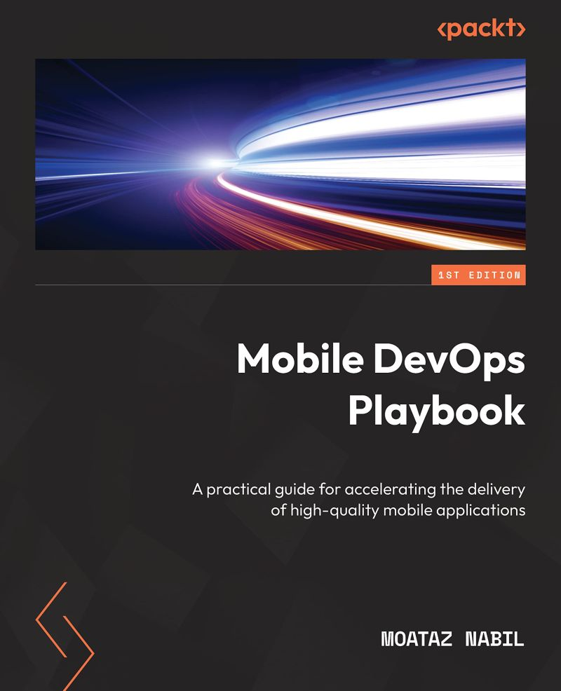

# Mobile DevOps Playbook 📘
### A practical guide for accelerating the delivery of high-quality mobile applications

## About the Book

The "Mobile DevOps Playbook" is an extensive guide that delves into various aspects of Mobile DevOps. It emphasizes practical approaches, tools, and methods to hasten the delivery of top-notch mobile applications. This book is designed for mobile app developers, DevOps professionals, and teams who want to enhance their app development and deployment procedures.

If you're interested in reading the full book, you can find it on the following platforms:

- 📕 [US Kindle and Paperback]([https://lnkd.in/eQ-dMceH](https://www.amazon.com/Mobile-DevOps-Playbook-accelerating-high-quality/dp/1803242558/ref=sr_1_1?keywords=9781803242552&qid=1680253844&sr=8-1))
- 📗 [UK Kindle and Paperback]([https://lnkd.in/eqb45qDQ](https://www.amazon.co.uk/Mobile-DevOps-Playbook-accelerating-high-quality/dp/1803242558/ref=sr_1_1?keywords=9781803242552&qid=1680253844&sr=8-1))
- 📘 [DE Kindle and Paperback]([https://lnkd.in/eRJnZTes](https://www.amazon.de/-/en/Moataz-Nabil/dp/1803242558/ref=sr_1_1?crid=10K2WZELU1F2R&keywords=mobile+devops&qid=1682510817&sprefix=%2Caps%2C123&sr=8-1))

Both Kindle and Paperback versions of the book will be available. To access other electronic formats, such as PDF and EPUB, please refer to the [Packt website](https://www.packtpub.com/product/mobile-devops-playbook/9781803242552).

## Who This Book Is For

If you're a DevOps Engineer looking to enhance your knowledge of Mobile DevOps for efficient mobile app releases, this book is an ideal resource for you. Mobile Developers, Mobile Release Managers, Mobile Platform Engineers, and QA Engineers involved in mobile app development can significantly benefit from this book. 

The Mobile DevOps Playbook provides valuable insights and practical advice to help you:

🚀 Increase your team's productivity and efficiency  
⏱️ Reduce the time required for delivering high-quality mobile applications  
🛠️ Address common challenges encountered during mobile app development  
🔐 Simplify your app development and deployment processes by utilizing industry-standard tools and techniques.

## 📖 Table of Contents

The book covers the following topics to explore in the world of Mobile DevOps:

1. **Resolving challenges in Mobile DevOps**
   Explore the unique challenges faced in Mobile DevOps and discover strategies to overcome them.

2. **Understanding the Mobile Ecosystem**
   Dive into the intricacies of the mobile ecosystem, including platforms, devices, and user expectations.

3. **Mobile DevOps Fundamentals**
   Build a strong foundation by understanding the core concepts and principles of Mobile DevOps.

4. **Achieving Continuous Delivery with Mobile DevOps**
   Learn how to establish a seamless pipeline for continuous delivery of your mobile applications.

5. **Implementing Robust Testing Strategies**
   Explore testing methodologies and strategies tailored for mobile applications to ensure their quality.

6. **Releasing Mobile Applications**
   Discover best practices for planning and executing successful mobile app releases.

7. **Establishing Monitoring and Observability for Mobile apps**
   Learn how to monitor your mobile apps effectively and gain insights into user behaviour.

8. **Keeping Mobile DevOps Secure**
   Understand security considerations and practices to safeguard your mobile DevOps processes.

9. **Best Practices for Mobile DevOps Teams**
   Explore proven best practices to enhance collaboration and productivity within your DevOps team.

10. **Improving Productivity with Developer Experience and Platform Engineering**
    Learn how to enhance developer experience and leverage platform engineering for better results.

11. **Predicting the Future of Mobile DevOps**
    Gain insights into emerging trends and predictions for the future of Mobile DevOps.

Happy learning and developing!
